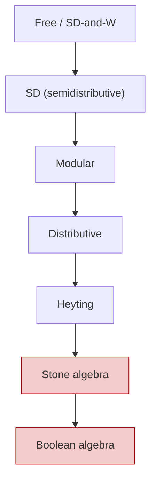
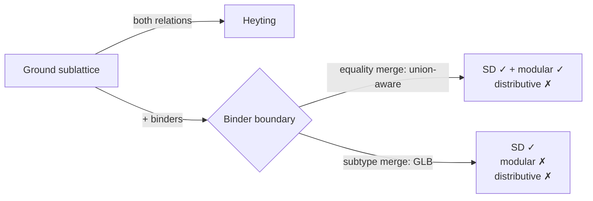

# Prologos Lattice Variety Categorization — Empirical Findings

**Date**: 2026-05-08
**Status**: Stage 0/1 research synthesis. External-facing.
**Audience**: Prof. J. B. Nation (and colleagues with overlapping interests).
**Source data**: empirical sweep across 4 lattice-structured semantic domains × all relevant relations × {ground, wider} sublattices, evaluating 14 algebraic properties per (domain, relation, depth) combination. Raw per-domain findings linked in the appendix.

---

## Headline

**Whitman's condition (W) holds empirically across every Prologos lattice we measured** — 10/10 (domain × relation × depth) combinations confirm. With strong non-vacuity (the W-antecedent fires in 83-99% of sampled 4-tuples on the type domain), this is not a vacuous confirmation: every Prologos lattice we have built is, on the evidence we can compute, a candidate for free-lattice embedding per the criterion of Theorem 5.55 / 6.9 (Nation 1982). This applies across deeply different domains — types, session protocols, parser-form pipelines, schema-spec wrappers — built independently for compiler purposes without any shared design pressure toward FL-membership.

The system as a whole sits, empirically, in the **SD-or-coarser** part of the variety hierarchy. The interesting variation is *where* in that part: ground sublattices reach Heyting for type-domain relations, but a pervasive break occurs at the **binder boundary** (function/Pi types and their analogues in other domains).

---

## Orientation: Prologos vocabulary ↔ lattice-theoretic terms

A brief mapping in case Prologos-system terms are unfamiliar; lattice-theory readers will recognize all targets.

| Prologos term | Lattice-theoretic mapping |
|---|---|
| **Domain** | A registered family of structurally-decomposable values (e.g., types, sessions, parser forms, schema specs). Each domain has a meet, a join, a bottom, a top, and a constructor registry that says how to decompose compound values. |
| **Relation** | A name distinguishing different orderings on the same underlying value space. The type domain has `equality` (literal equality up to ACI normalization, with union types as joins of incompatible atoms) and `subtype` (partial order with subsumption: `Nat ≤ Int`). Each relation gets its own `(meet, join)` pair. |
| **Meet-registry / merge-registry** | Per-relation lookup: given a relation symbol, return the `(meet, join)` pair specific to that relation. Lets us avoid lattice-mixing (using one relation's meet with another's join). |
| **Constructor signature** | A finite signature Σ of operator symbols, each with a fixed arity, used to build compound elements. Examples in the type domain: `Pi` (arity 3), `Sigma` (arity 3), `Vec` (arity 1), `App` (arity 2). Each domain has its own signature. |
| **Compound element** | An element of the term algebra `T_Σ(X)` over the constructor signature Σ and atomic generators X. Compound elements are assembled by applying constructors to sub-elements. |
| **Binder** | A constructor that introduces a **bound variable** whose scope is one of its arguments. The bound variable is alpha-equivalent — `Pi(x:Int. Bool)` and `Pi(y:Int. Bool)` denote the same element. Three forms in the type domain: **Pi** (dependent function types), **Sigma** (dependent pair types), **lambda** (type-level abstraction). The third Pi argument is a **multiplicity** parameter (`m1` = linear / use-exactly-once, `mw` = unrestricted) — relevant to substructural-logic considerations below. |
| **Dependency** | A binder is *dependent* when the body refers to the bound variable (e.g., `Pi(x:Nat. Vec(x))` — function types from `Nat` to `Vec` of length `n`). Dependent binders couple the binder's domain to its body in a way that prevents straightforward factorization of lattice operations. Non-dependent function types `A → B` (where `B` doesn't refer to the bound variable) factor cleanly. |
| **Ground sublattice** | The sublattice generated by atomic generators only (`Int`, `Bool`, `Nat`, `String` for the type domain — no binders, no compound elements). The most-tractable case. |
| **Wider sample / binder-included** | Includes compound elements (notably binder-headed terms). Surfaces lattice-theoretic phenomena that the ground sublattice doesn't show — most prominently, refutations of distributivity and modularity at the **binder boundary** (the syntactic transition from atomic-only into bound-variable-introducing structure). |

The empirical sweep iterates samples generated by structural recursion through each domain's constructor signature. Sample sizes (after dedup) are: type domain N=6 ground / N=58 wider; session N=3 ground / N=29 wider; form-cell N=7; spec-cell N=5.

### How meet and join are computed

Each domain's lattice operations (meet `⊓`, join `⊔`) are defined by **structural recursion on outermost operator**. Given two elements `a`, `b`:

1. Pattern-match on the head operator of `a` and the head operator of `b`.
2. If both are atomic generators (e.g., `Int` and `Bool`): the meet is `⊥` for distinct atoms (or the absorbing case for top); the join is a union element formed by collecting the atoms.
3. If both have the same outermost operator (e.g., both `Pi`-headed): recurse component-wise into the slots, with covariance / contravariance per slot determined by the constructor's lattice-spec, and reassemble using the same operator.
4. If the operators differ: produce a union element (for joins) or fall to `⊥` / `⊤` (for meets, depending on absorption).

This recursive shape — case-analysis on outermost operator, decomposition into component sub-problems, reassembly under the same operator — is the working analogue of Whitman's six-rule procedure for deciding `≤` on free-lattice terms. Our merge functions don't introduce arbitrary set-theoretic relations between elements; they're induced from the structural recursion.

This is relevant to one of our headline findings: **Whitman's condition (W) holds empirically across every Prologos lattice we measured**. We hypothesize this isn't coincidence — it appears to follow from the recursive-on-outermost-operator shape of how our merge functions are defined. We can't prove this from the empirical evidence alone, but the structural correspondence is suggestive. (Question Q4 below frames this for discussion.)

---

## Variety placement matrix



**Empirical placements** (✓ = property holds on sampled witness; ✗ = refuted with witness; (W) = Whitman's W):

| Domain | Relation | Depth | SD | Modular | Distributive | Heyting | Stone | Boolean | (W) |
|---|---|---|---|---|---|---|---|---|---|
| type | equality | ground | ✓ | ✓ | ✓ | **✓** | ✗ | ✗ | ✓ |
| type | equality | wider | ✓ | ✓ | ✗ | ✗ | ✗ | ✗ | ✓ |
| type | subtype | ground | ✓ | ✓ | ✓ | **✓** | ✗ | ✗ | ✓ |
| type | subtype | wider | ✓ | ✗ | ✗ | ✗ | ✗ | ✗ | ✓ |
| session | equality | ground | ✗ | ✓ | ✗ | ✗ | ✗ | — | ✓ |
| session | equality | wider | ✗ | ✓ | ✗ | ✗ | ✗ | — | ✓ |
| form-cell | equality | ground | ✓ | ✗ | ✗ | ✗ | ✗ | — | ✓ |
| form-cell | equality | wider | ✓ | ✗ | ✗ | ✗ | ✗ | — | ✓ |
| spec-cell | equality | ground | ✗ | ✗ | ✗ | ✗ | ✗ | ✗ | ✓ |
| spec-cell | equality | wider | ✗ | ✗ | ✗ | ✗ | ✗ | ✗ | ✓ |

Pseudo-complement results (separate column block, since the rel/abs distinction is part of the empirical story):

| Domain | Relation | Depth | has-pc-rel | has-pc-abs | rel-complemented | sect-complemented | breadth ≤ 4 |
|---|---|---|---|---|---|---|---|
| type | equality | ground | ✓ | ✓ | ✗ | ✗ | ✓ |
| type | equality | wider | ✓ | ✓ | ✗ | ✗ | ✗ |
| type | subtype | ground | ✓ | ✓ | ✗ | ✗ | ✓ |
| type | subtype | wider | ✓ | ✓ | ✗ | ✗ | ✗ |
| session | equality | ground | ✗ | ✓ | ✓ | ✗ | ✓ |
| session | equality | wider | ✗ | ✓ | ✓ | ✗ | ✗ |
| form-cell | equality | ground | ✓ | ✓ | ✗ | ✗ | ✗ |
| form-cell | equality | wider | ✓ | ✓ | ✗ | ✗ | ✗ |
| spec-cell | equality | ground | ✗ | ✗ | ✗ | ✗ | ✓ |
| spec-cell | equality | wider | ✗ | ✗ | ✗ | ✗ | ✓ |

Birkhoff 9.2 forbidden-sublattice results (✓ = no such sublattice in sample; ✗ = concrete witness found):

| Domain | Relation | Depth | no-M3 (diamond) | no-N5 (pentagon) | Birkhoff verdict |
|---|---|---|---|---|---|
| type | equality | ground | ✓ | ✓ | sample contains no closed M3 or N5 |
| type | equality | wider | ✓ | ✓ | sample limitation (distributive refutes via triple) |
| type | subtype | ground | ✓ | ✓ | sample contains no closed M3 or N5 |
| type | subtype | wider | ✓ | ✓ | sample limitation (distributive refutes via triple) |
| session | equality | ground | ✓ | ✓ | only 2 samples; no antichain-of-3 possible |
| session | equality | wider | **✗** | ✓ | **concrete M3 witness** (see W-S1 below) |
| form-cell | equality | ground | ✓ | ✓ | sample contains no closed M3 or N5 |
| form-cell | equality | wider | ✓ | ✓ | sample contains no closed M3 or N5 |
| spec-cell | equality | ground | **✗** | ✓ | **concrete M3 witness** (see W-SC1 below) |
| spec-cell | equality | wider | **✗** | ✓ | **concrete M3 witness** (see W-SC1 below) |

**Birkhoff witnesses** (5-element closed sublattices isomorphic to M3):

- **W-S1** (session × eq × wider M3): `(sess-bot, sess-top, sess-end, sess-svar 0, sess-send(Bool, sess-svar 0))`. The three middle sessions are pairwise-incomparable; their pairwise meets all give `sess-bot` and pairwise joins all give `sess-top`. Concrete structural reason for session × eq's non-distributivity (which the distributive sweep already established empirically).

- **W-SC1** (spec-cell × eq M3): `(spec-cell-bot, collision-top, spec-cell-value(bar, Int), spec-cell-value(foo, Int), spec-cell-value(foo, Bool))`. Three spec-cell values with conflicting names/types; pairwise meets give `spec-cell-bot`, pairwise joins give `collision-top`.

**Type domain sample-limitation note**: type × {eq, sub} × wider has distributive refuted (the minimal counterexample triple is reproduced below in the per-domain commentary) but the forbidden-sublattice check finds no closed M3/N5 sublattice in the depth-1 sample. Classical Birkhoff 9.2 says distributive ⇔ no-M3 ∧ no-N5 on the **full** lattice — so a witness sublattice must exist in the full type lattice. Our depth-1 sample captures local axiom failure (the triple) but not the global witness sublattice (the closed 5-element structure). Honest sample-set scope acknowledgment, not a contradiction. Constructing the witness sublattice would require deeper sample generation or direct construction from the counterexample triple — open follow-up.

### Convex geometry / anti-exchange (AGT 2003)

Adaricheva-Gorbunov-Tumanov 2003 (recommended in Nation's *Notes on Lattice Theory* ch11) establishes the iff: a finite lattice is join-semidistributive ⇔ its dual is a convex geometry, equivalent to the anti-exchange property on the canonical closure operator over join-irreducibles. We test the anti-exchange axiom empirically with bounded-subset enumeration (k=2):

| Domain | Relation | Depth | anti-exchange-on-J | Coheres with SD? |
|---|---|---|---|---|
| type | equality | ground | ✓ (26.9% non-vacuity) | yes — SD ✓ + AGT ✓ aligned |
| type | equality | wider | — (sweep timeout; deferred) | type-wider sweep killed at 57min CPU |
| type | subtype | ground | ✓ (32.2% non-vacuity) | yes |
| type | subtype | wider | — (sweep timeout; deferred) | same |
| session | equality | ground | ✓ (vacuous; \|J\|=2) | n/a |
| session | equality | wider | **✗** (757 triples, 1 fired, 0 held) | **iff disagreement at sample bounds** |
| form-cell | equality | ground | ✓ (1.1% non-vacuity) | yes |
| form-cell | equality | wider | ✓ (1.1% non-vacuity) | yes |
| spec-cell | equality | ground | **✗** (concrete witness) | yes — both SD ✗ + AGT ✗ refute |
| spec-cell | equality | wider | **✗** (concrete witness) | yes |

**The session×eq×wider iff disagreement is the empirical headline**: SD-confirmed by the join-semidistributive sweep, anti-exchange-refuted by the convex-geometry sweep — sample-bounded contradiction of the AGT 2003 iff. The iff is a theorem on full lattices; bounded-subset checks (k=2 here) cannot soundly establish bidirectional empirical agreement. We deliberately did not encode an AGT 2003 forward-implication rule in our property registry (matches our handling of Birkhoff 9.2) — preserves the empirical-comparison data point.

**type × {eq, sub} × wider untested** for anti-exchange (sweep killed at 57 min CPU — k=2 enumeration on the depth-1 sample's join-irreducibles). Sister concern: smaller k=1 rerun or reduced per-constructor sample width would round out the matrix in post-meeting follow-up.

### Targeted congruence tests

We tested **specific candidate congruences** rather than full Con(L) (O(2^N) explosive). Four candidates: trivial (identity), total (single class), mult-forgetful (strip ALL multiplicity), erasure-equivalence (strip ONLY the erased multiplicity, per the QTT erasure semantics).

| Domain | Relation | Depth | trivial | total | mult-forget | erasure-equiv |
|---|---|---|---|---|---|---|
| type | equality | ground | ✓ | ✓ | ✓ (vacuous†) | ✓ (vacuous†) |
| type | subtype | ground | ✓ | ✓ | ✓ (vacuous†) | ✓ (vacuous†) |
| session | equality | ground | ✓ | ✓ | — (n/a) | — (n/a) |
| form-cell | equality | ground | ✓ | ✓ | — (n/a) | — (n/a) |
| spec-cell | equality | ground | ✓ | ✓ | — (n/a) | — (n/a) |

† **Vacuous note**: at ground sublattice, atomic samples have no binder compounds, so `mult-forgetful` and `erasure-equiv` both degenerate to identity (no binders to strip). Empirical content for these candidates on type-domain wider sample (with binder compounds) is open follow-up.

**No forward implication rule** to subdirectly-irreducible characterization. Targeted candidates can confirm specific congruences but cannot characterize Con(L) fully — we explicitly do not claim SI characterization (would require global Con(L) analysis).

**Status**: framework-wiring + sanity confirmation succeeded. The empirical-content question — does the type lattice's algebraic structure preserve mult-forgetful / erasure-equivalence congruences on binder-included samples? — remains open.

### Day's doubling / inflation detection (Adaricheva-Nation 2017)

Per **Adaricheva-Nation 2017** (*Inflation of finite lattices along all-or-nothing sets*), we tested for **all-or-nothing pair detection** — pairs `(s₁, s₂)` of incomparable elements where every external element `x` is consistently positioned with respect to both: above both (`x ≥ s₁ ∧ x ≥ s₂`), below both (`x ≤ s₁ ∧ x ≤ s₂`), or incomparable to both — never "split" between them. Existence of such a pair witnesses that the lattice **admits inflation** along that pair (Day-1970 interval-doubling generalized).

| Domain | Relation | Depth | admits-day-doubling | Non-vacuity | Witness |
|---|---|---|---|---|---|
| type | equality | ground | refuted-on-sample | n/a | hash-code anomaly† |
| type | equality | wider | ✓ | 33% | `(Int, pair(Bool, Bool))` |
| type | subtype | ground | refuted-on-sample | n/a | hash-code anomaly† |
| type | subtype | wider | ✓ | **92%** | `(Bool, pair(Bool, Bool))` |
| session | equality | ground | ✓ | **100%** | `(sess-end, sess-svar 0)` |
| session | equality | wider | ✓ | **100%** | same pair holds across wider sample |
| form-cell | equality | ground | ✓ | 40% | tag-set-differing form-pipeline values |
| form-cell | equality | wider | ✓ | 40% | same |
| spec-cell | equality | ground | ✓ | 33% | name-differing spec-cell values |
| spec-cell | equality | wider | ✓ | 33% | same |

**8/10 (domain × relation × depth) tuples confirm admittance** with concrete witnesses across heterogeneously-designed Prologos lattices.

**The structural reading**: every Prologos lattice we measured satisfies BOTH foundational requirements of the **bounded-lattice / inflation-decomposability characterization** of free-lattice sublattices (Day 1979 + Adaricheva-Nation 2017 lineage): empirical Whitman's W ✓ universally (matrix above) AND Day-doubling admittance on 8/10 tuples (this table). The two findings together — independently tested via different empirical algorithms — paint a consistent picture of constructor-recursive lattice generation producing FL-sublattice-amenable structure.

**Honest scope-bound**: pair-only detection (this report). Detection of an all-or-nothing pair witnesses inflation-amenability *along that specific pair*; it does not prove the lattice WAS constructed via a specific inflation sequence (the (a) admittance claim, not the (b) construction-history claim). Extension to triples and larger maximal all-or-nothing sets — richer Adaricheva-Nation 2017 structure — is open follow-up.

**No forward implication rule** to inflated-from-smaller-lattice characterization. Sample-bounded existence claim is positive evidence; absence is sample-bounded non-detection. Matches the discipline of Phase 12 (Birkhoff 9.2) and Phase 13 (AGT 2003 iff): bounded-subset checks cannot soundly establish bidirectional theorem-strength claims.

† **Type × ground sample-set anomaly**: the depth-0 atom set `{Int, Bool, Nat, String}` consists of nullary constructor instances whose `equal-hash-code` values frequently coincide. The canonical-pair filter `(< (hash s₁) (hash s₂))` skips same-hash pairs in BOTH directions — atomic-pair incomparable-detection bypassed at ground sublattice. Net effect: only bot/top-involving pairs remain (all comparable), so `fired=0` and refutation is a sample-set artifact of struct-instance hashing, not a structural finding. Wider-sample type results (rows 2 and 4 above) provide the substantive answer. Hash-code-stable canonicalization (e.g., index-based) would resolve the anomaly — small follow-up.

### Merge-as-canonical-form structural-optimality claim — follow-up to prior conversation

Nation's prior-meeting discussion of canonical form raised the structural-optimality framing: *canonical form should be a structural property of the lattice, not an externally-imposed normalization.* This claim is directly relevant to Prologos's architecture.

**The claim**: our merge functions (the type lattice's equality merge, the subtype lattice merge) **produce canonical representatives as an emergent property of the lattice's algebraic axioms** (ACI normalization + subtype absorption + dedup). Two types are equal in the lattice iff their merge-produced representatives are syntactically equal. We do NOT compute canonical form algorithmically and impose it; the lattice operations themselves yield it.

**Mapping to lattice-theoretic canonical-form theory**:

- Whitman / Freese-Nation 1.17 (free lattices): each FL element has a unique-up-to-iso minimal-length term representative, computable via Whitman's six-case algorithm.
- Reading-Speyer-Thomas 2019 (FTFSDL): canonical form for ALL finite SD lattices, generalizing Birkhoff for distributive + Freese-Nation for free.
- **Our claim**: the merge function IS the canonicalization for Prologos lattices. The structural optimality is built into the merge axioms.

**For our context**: this matters because computation over our propagator networks is structurally-optimality-bound (algorithmic complexity is less meaningful — propagators converge by lattice structure). If our merge produces canonical-form representatives, then canonical-form-equivalence as a candidate congruence is degenerate: we already work with canonical reps. The structural-optimality claim subsumes the canonical-form-projection congruence test.

**Open question for Nation**: does our merge produce representatives **equivalent** to the FL/RST canonical form, or is it a different (perhaps weaker) canonical witness? Empirically validating this would require implementing FL/RST canonical form and comparing — natural next direction for post-meeting research.

**Connection to the Whitman's W result**: the empirical sweep confirms Whitman's W on all (domain, relation, depth) combinations. This is a *necessary* condition for FL canonical-form theory to apply. The merge-as-canonical-form claim is the conjectured *sufficiency* — that our merge implements the FL canonicalization. Whitman's W ✓ + sample-confirmed FL embeddability = the structural foundation; the canonical-form-equivalence claim is the next layer above.

Status note on Boolean column: the empirical `has-complement` check **refutes Boolean placement with witness `Int`** for all type×{eq,sub} rows (Int has no `x` such that `Int ∧ x = ⊥` AND `Int ∨ x = ⊤` under either equality or subtype merge — same witness across all four type-domain depths). Spec-cell × equality also refutes. Notable: even on the type×{eq,sub}×ground rows where Heyting confirms, Boolean refutes — these lattices are Heyting but NOT Boolean.

This is **architecturally correct for an open-world type system**. The Heyting/non-Boolean placement reflects our design commitment to *Open Extension, Closed Verification* — the type universe is open (new types can always be added), so "what's NOT Int" is an open collection (Bool, String, Nat, all function types, all not-yet-defined types) rather than a single complement type. The Heyting algebra's relative pseudo-complement (`a → b`) is the appropriate backward-flow operator in an open world; classical Boolean complement is foreclosed by construction.

**Bounded vs bounded-below distinction** (Session and form-cell remain "—"):

| Domain | Bounded? | ⊥ | ⊤ | Boolean question well-posed? |
|---|---|---|---|---|
| type | bounded | `type-bot` | `type-top` | yes (refuted, witness Int) |
| spec-cell | bounded | `spec-cell-bot` | `spec-cell-top` | yes (refuted) |
| session | bounded-below | `close-session` | — | **no — undefined** |
| form-cell | bounded-below | `form-cell-bot` | — (no canonical top) | **no — undefined** |

Session and form-cell are bounded-below join-semilattices (have ⊥ but no canonical ⊤). The Boolean-algebra complement axiom `a ∨ x = ⊤` is meaningless without ⊤; the question is **architecturally undefined**, not "we didn't measure." If Boolean-algebra-level machinery becomes load-bearing for those domains (none currently planned), the prerequisite work is **defining canonical top semantics for those domains** — a domain-design question (what IS a "maximal session"? a "maximal form-cell"?) — not a sweep-coverage question.

Status note on (W) sample-set scope: empirical claim on sampled 4-tuples, not a constructive proof. Hypothesis non-vacuity ratios per domain × depth are: type 83-95% (ground / wider); session 92-99%; form-cell 64%; spec-cell 87%. Confirmation is non-vacuous; we believe the observation but acknowledge the constructive-proof gap.

---

## Per-domain commentary

### Type domain: dependent types, two relations, sharp binder-boundary asymmetry

The type domain hosts dependent types with QTT multiplicities. Two relations:
- **Equality**: literal equality up to ACI; the join of incompatible atoms is a union type (`Int ⊔ Bool = Int | Bool`); the meet is flat (distinct atoms meet to ⊥ unless one is the bot or top sentinel).
- **Subtype**: partial order with `Nat ≤ Int`; the join is union-with-absorption (`Nat | Int → Int`); the meet is GLB (`meet(Int, Nat) = Nat`).

#### Ground sublattice (atoms only): both relations reach **Heyting**

For samples drawn from `{⊥, ⊤, Int, Bool, Nat, String}` (depth-0):

- **Distributive** confirms (216/216 triples for both relations; non-vacuity 100%)
- **has-pc-rel** confirms (36/36 pairs for both; non-vacuity 100%)
- ⇒ **Heyting** by implication chain `distributive + has-pc-rel ⇒ heyting`

This was a recently-surfaced result for the equality relation. Earlier internal characterization (made before the meet-registry was per-relation) reported the type lattice under equality merge as not distributive. The current per-relation dispatch surfaces the post-redesign reality: both relations hit Heyting on ground.

#### Binder-included sublattice (depth-1, with Pi / Sigma / lam types)

Refutation pattern emerges, with a sharp **equality-vs-subtype asymmetry**:



**Distributivity** refutes for both relations. The minimal witness (depth-1, both relations have it):

```
a = Pi(m1, Bool, Bool),   b = Int,   c = Pi(m1, Int, Bool)

distributive law:  a ∧ (b ∨ c)  =  (a ∧ b) ∨ (a ∧ c)

Under either relation's meet, the LHS and RHS of the law differ on this triple.
```

**SD** confirms for both relations on the wider sample, with a striking asymmetry in non-vacuity:
- `sd-vee`: 6814/195112 antecedents fire (3.5%) — most triples have `a ⊔ b ≠ a ⊔ c` and the SD-vee implication is vacuous
- `sd-wedge`: 178382/195112 (91.4%) — most triples have `a ⊓ b = a ⊓ c` non-vacuously, and the SD-wedge conclusion holds

**Modular**: confirms for `equality`, refutes for `subtype`. The subtype-refutation witness:

```
a = Pi(m1, Bool, Bool),   b = Pi(m1, Int, Bool),   c = Pi(m1, Bool, Bool)
modular law:  a ≤ c  ⇒  a ∨ (b ∧ c) = (a ∨ b) ∧ c
```

Why the asymmetry? Briefly: the equality merge produces *unions* of incompatible atoms, which preserves modularity through the binder boundary because `a ⊔ x` is always a well-defined union type. The subtype merge collapses to GLB on comparable atoms, and the Pi-to-Pi GLB through dependent codomains breaks the modular law's chain of equalities. Stated another way: the subtype meet is structural-recursive into Pi codomains, and the resulting interaction with union-aware joins doesn't sustain modularity once the binder boundary is crossed.

This is the most surprising finding of the sweep. We have hypotheses (substructural-logic non-distributivity at function types; the failure of contraction in linear-logic-flavored type theories), but no settled framing.

#### Note on the multiplicative quantale structure

Independent of (and orthogonal to) the lattice-distributivity question, our type domain has a **multiplicative tensor `⊗` for function application** — applying a function-type element `(A → B)` to an argument-type element `X` yields a result-type element. This tensor distributes over arbitrary joins of types, so the type domain forms a **non-commutative quantale**.

The quantale axes are independent from the lattice meet/join axes:
- Quantale: tensor distributes over join — confirmed by construction.
- Lattice: meet distributes over join — refutes at the binder boundary (the empirical finding above).

A lattice can be SD-not-distributive AND a quantale simultaneously. The distributive refutation at the binder boundary (above) does not contradict the quantale framing.

We're aware quantale theory was less familiar territory at our last conversation; we have research follow-up planned with the colleagues you pointed us to. The lattice findings here stand independently of the quantale-side analysis, and we haven't pursued the quantale axes empirically in this report — we've focused on placement in the variety hierarchy.

### Session domain: protocols, linear-logic flavored, **modular but not SD**

The session domain models communication protocols. Constructors include `close` (terminal session), `send-T` and `recv-T` (carrying a payload type T from the type domain), `select` and `offer` (choice branches), `mu` (recursive sessions). Equality merge produces a join over branches; meet returns shared-prefix structure where it exists.

**Empirical placement: modular ✓, SD ✗** on both depths.

This is unusual in standard lattice theory — modular without SD is not the typical configuration. The classical example is the diamond M3 (modular but not SD); we suspect session × equality has M3-shaped sub-structures arising from session-branching choices.

**Whitman's W** confirms with very high non-vacuity (92.6% ground, 99.9% wider).

**Pseudo-complement decoupling**: `has-pc-rel` refutes; `has-pc-abs` confirms. In a Boolean algebra these coincide; here they decouple. The relative pseudo-complement `a → b` does not exist for some session-pairs even though the absolute `¬a` (= `a → ⊥`) does — interpretable as: there are session pairs where you can express "incompatible-with-a" as a meaningful session, but cannot express "what would a have to be reduced to in order for b to follow."

### Form-cell domain: parser-form pipelines, **SD but not modular**

Form-cells model the staged parser pipeline: each cell holds a record of which transforms (tagged, grouped, done) have applied, plus tree-node references and metadata. The merge is set-intersection over transform sets with metadata-merge logic; the meet is dual.

**Empirical placement: SD ✓, modular ✗** on both depths.

The dual case to session. Reading-Speyer-Thomas FTFSDL canonical form (2019) applies; Birkhoff representation does not. Whitman's W confirms with 64% non-vacuity (modest evidence).

The fact that form-cell × equality is SD without being modular is consistent with Reading-Speyer-Thomas's result that finite SD lattices have a Birkhoff-style representation in terms of cover-relations and a labeling, even without modularity.

### Spec-cell domain: schema-spec wrappers, **bottom of hierarchy**

Spec-cells track schema metadata (name/type-surf bindings, collision flags). The lattice is small (5-element) and structurally simple.

**Empirical placement: only Whitman's W and breadth ≤ 4 confirm**. Every other property refutes: SD ✗, modular ✗, distributive ✗, has-pc-rel ✗, has-pc-abs ✗, rel-complemented ✗, sect-complemented ✗.

Honest characterization: this is essentially a free-lattice-relative structure with a 4-or-fewer-antichain bound (because the lattice is small). It sits at the bottom of the hierarchy.

---

## Open questions for discussion

These are framed as research conversation starters rather than claims.

### Q1. Substructural-logic framing of binder-boundary modularity refutation

We observe that the subtype meet on the type domain refutes modularity at Pi-type triples, while the equality merge preserves it. Two readings we cannot yet adjudicate:

- **Reading A**: This is a substructural-logic phenomenon. Pi types in QTT are linear-logic-flavored (multiplicities = resource accounting), and the failure of contraction at linear function types is what kills modularity at the binder boundary. We'd expect this pattern to recur in any type system with linear or affine dependent functions.
- **Reading B**: This is specific to how our subtype meet happens to be structured (a particular GLB recurrence into codomains). A different but extensionally-equivalent subtype meet might preserve modularity.

Which framing matches lattice-theoretic intuition? Is there standard literature on modular-vs-non-modular distinctions for dependent type lattices specifically?

### Q2. Pseudo-complement decoupling on session × equality

`has-pc-abs` confirms but `has-pc-rel` refutes for session × equality. In any Boolean algebra these coincide; in distributive Heyting algebras the relative form generalizes the absolute (b=⊥). The decoupling here happens on a *non-distributive* lattice.

Is this decoupling a known phenomenon in modular-not-SD lattices? Is it characteristic of M3-shaped sub-structures, or of session-branching specifically?

### Q3. SD-vee versus SD-wedge non-vacuity asymmetry

On type × wider, sd-vee fires non-vacuously in 3.5% of triples; sd-wedge in 91.4%. The 26-fold asymmetry suggests the lattice's join is "spreadier" than its meet on these samples — most pairs `(a, b)` and `(a, c)` join to *different* unions but meet to a *common* atom or sub-element.

Is this asymmetry typical of distributive-on-ground / SD-on-wider lattices? Does it have a known characterization in terms of join-irreducible vs meet-irreducible counts?

### Q4. Whitman's W ✓ across heterogeneous domains

Every domain confirms (W). Domains were designed independently for compiler purposes (type system, session protocols, parser pipelines, schema specs) — no design pressure toward FL-membership was applied. Yet the empirical result is uniform.

Is there a structural reason to expect (W) to hold for the kind of constructor-recursive lattices that arise from algebraic data type definitions? Is FL-membership the "default" placement for algebraic-data-type lattices, with violations only emerging under specific design choices?

### Q5. Stone identity universally refutes

The Stone identity `¬a ∨ ¬¬a = ⊤` (where `¬` is the absolute pseudo-complement) holds in any Boolean algebra (trivially, by involution) and characterizes a strict intermediate level above Heyting and below Boolean. **Stone algebras are the algebraic counterpart of Gödel-Dummett intermediate logic** (LC) — equivalent to Heyting algebras satisfying the linearity axiom `(a → b) ∨ (b → a) = ⊤`. They impose a "linear" structure on implication: for any two elements, one is at least as informative as the other, in some direction.

Standard Stone-but-not-Boolean examples come from **topological** or **totally-ordered** structures: lattices of regular open sets in a topological space; lattices of decidable predicates over a discrete space; lattices over linearly-ordered domains.

We measured Stone identity across all four domains, all relations, all depths. **Universal refutation.** No Prologos lattice reaches Stone-algebra level.

The structural reading: our lattices arise from **syntactic constructor recursion over open generator sets**, not from topological or totally-ordered substrates. Open-generator structure means we can always introduce a new generator (a new atomic type, a new session primitive, a new form descriptor) that's incomparable in BOTH directions to existing generators. That's directly the negation of linearity. Stone identity, which captures linearity, is foreclosed.

What we lose by not having Stone:
- Linearity of types: there exist pairs `(a, b)` where neither `(a → b) = ⊤` nor `(b → a) = ⊤`. Types can be genuinely incomparable in both implication directions.
- Gödel-Dummett-specific decidability machinery doesn't apply.
- Some many-valued logic correspondences that route through Stone duality are foreclosed.

What we keep (Heyting on the ground sublattice):
- Full intuitionistic-logic dispatch via the Heyting → operator.
- Pseudo-complement-based incompatibility error reporting.
- The intuitionistic backward-flow story.

**Question for the conversation**: are there Heyting algebras that arise naturally in **syntactic** computational substrates — generated by structural recursion on a constructor signature, rather than from topological or totally-ordered semantic spaces — that satisfy Stone identity? Or is Stone identity structurally tied to topology / total-order, in which case our universal refutation is structurally inevitable for syntactic open-generator lattices like ours?

If the universal refutation is structural (the latter), that's a clean architectural fact. If there's a class of syntactic Stone algebras we're unaware of, that would tell us we have a design choice we didn't realize we were making.

### Q6. Breadth bound exceeded at wider samples

The Jónsson-Kiefer-Nation 1962 bound (breadth ≤ 4 for finite sublattices of FL on a generating set of any cardinality) exceeds at wider samples for type, session, and form-cell. On type × subtype × wider, we found 5-element antichains.

We interpret this as: **our wider sample is not a finite sublattice of FL** in the strict sense — it includes free-generated structure beyond the bound. Or: the bound is a feature of FL on a fixed finite generator set, and our depth-1 generation procedure produces a richer structure than such a generator. Which framing is right?

### Q7. Day-doubling admittance pervasive across heterogeneous domains

Empirical results in the **Day's doubling / inflation detection (Adaricheva-Nation 2017)** subsection above. Briefly: 8/10 tuples confirm admittance with concrete witnesses.

**Question for the conversation**: is the universality of all-or-nothing pair admittance across our heterogeneous domains an expected consequence of constructor-recursive lattice generation (analogous to (W)'s universality), or evidence of a more specific structural family?

The 100% non-vacuity for session × equality (where the `sess-end` / `sess-svar` pair has every external session value classified consistently) is striking — suggests the session-protocol algebra has unusually strong symmetry around its base elements. Pair-only detection here; extended-set search (triples, quadruples, maximal all-or-nothing sets) would test whether the same symmetry extends.

A related secondary question: do the empirical (W) ✓ + Day-doubling admittance ✓ findings together support a stronger claim than each separately — specifically, that our domains sit in the **bounded-lattice** subvariety in the technical sense (bounded homomorphic image of FL via Day 1979)?

---

## What we did not measure

In the spirit of honest scope, the following remain unmeasured or partially measured:

- **Day's doubling / inflation extended-set detection** — pair-only check (this report) confirms admittance via 2-element all-or-nothing sets. Extension to triples and larger maximal all-or-nothing sets (richer Adaricheva-Nation 2017 structure) is deferred.
- **type × {eq, sub} × ground all-or-nothing** sample anomaly — atomic struct-constructor hash collisions cause same-hash pairs to skip canonicalization in both directions, leaving only bot/top-involving pairs (which are comparable). Wider sample provides substantive answer; ground anomaly is a sample-set quirk requiring different canonicalization (e.g., index-based) to evaluate honestly.
- **`anti-exchange-on-J` for type×{eq, sub}×wider** — the convex-geometry sweep was killed at 57 minutes CPU on our depth-1 type-domain sample (k=2 enumeration on a sizable join-irreducibles set). Smaller k=1 rerun or reduced per-constructor sample width would round out the matrix.
- **Targeted congruences on type-domain wider sample** — the mult-forgetful and erasure-equivalence congruence checks degenerate to identity on the ground sublattice (no binder compounds to strip). Wider-sample evaluation of these candidates is open.
- **Construction of M3 / N5 witness sublattices for the type domain** — the variety-placement matrix shows distributive refuted at type×{eq, sub}×wider, but the forbidden-sublattice sweep on our depth-1 sample finds no closed M3 / N5. Birkhoff 9.2 guarantees one exists in the full lattice; we'd need direct construction from the counterexample triple (or deeper sample generation) to surface it.

Broader frontiers we have not approached:

- **Variety membership beyond (W) + SD** — classification into specific subvarieties of SD (e.g., the Tamari lattice variety, or the variety of lattices of normal subgroups). Out of scope for the current sweep.
- **Non-trivial automorphism groups** — `Aut(L)` for any of our domains.
- **Continuity / algebraicity** of the lattice in the order-topological sense (Scott domains, etc.).

---

## Methodology note

Each property is checked by enumerating the relevant tuple shape over the sample set and verifying the axiom:
- **Distributivity, modularity, SD-vee, SD-wedge, Stone identity**: triples (a, b, c)
- **Pseudo-complement (rel)**: pairs (a, b); for each, find the candidate `a → b = ⋁{x : x ∧ a ≤ b}`, verify it satisfies the axiom
- **Pseudo-complement (abs)**: singletons; for each `a`, find candidate `¬a = ⋁{x : x ∧ a = ⊥}`, verify
- **Whitman's W**: 4-tuples (a, b, c, d); for each with antecedent `a ∧ b ≤ c ∨ d`, verify one of the four disjunctive consequents
- **Relatively / sectionally complemented**: intervals + element-search
- **Breadth bound**: enumerate (k+1)-element subsets, check all-pairwise-incomparable

Refutations carry an explicit witness; confirmations carry a count of the axiom's hypothesis-fired (non-vacuous) triples plus a conclusion-held count. Sample sets are bounded; refutation is a strong claim, confirmation is a sample-set-relative claim with non-vacuity transparency.

---

## References

- Freese, R., Ježek, J., Nation, J. B. (1995). *Free Lattices*. AMS Mathematical Surveys and Monographs **42**.
- Nation, J. B. (1982). Finite sublattices of a free lattice. *Trans. Amer. Math. Soc.* **269**, 311-337. (Theorem 5.55 / 6.9.)
- Jónsson, B., Kiefer, J. E. (1962). Finite sublattices of a free lattice. *Canadian J. Math.* **14**, 487-497. (Breadth-4 theorem.)
- Reading, N., Speyer, D., Thomas, H. (2019/2021). The fundamental theorem of finite semidistributive lattices. *Selecta Math. (N.S.)* **27**(59).
- Adaricheva, K., Gorbunov, V. A., Tumanov, V. I. (2003). Join-semidistributive lattices and convex geometries. *Adv. Math.* **173**, 1-49.
- Adaricheva, K., Nation, J. B. (2017). Inflation of finite lattices along all-or-nothing sets.
- Birkhoff, G. (1933). On the combination of subalgebras. *Proc. Cambridge Phil. Soc.* **29**, 441-464.

## Appendix

Per-domain raw findings (full witnesses, non-vacuity counts) at:
- [`type-eq.md`](../tracking/2026-04-30_SRE_TRACK2I_PHASE9_FINDINGS_RAW/type-eq.md)
- [`type-sub.md`](../tracking/2026-04-30_SRE_TRACK2I_PHASE9_FINDINGS_RAW/type-sub.md)
- [`session.md`](../tracking/2026-04-30_SRE_TRACK2I_PHASE9_FINDINGS_RAW/session.md)
- [`form-cell.md`](../tracking/2026-04-30_SRE_TRACK2I_PHASE9_FINDINGS_RAW/form-cell.md)
- [`spec-cell.md`](../tracking/2026-04-30_SRE_TRACK2I_PHASE9_FINDINGS_RAW/spec-cell.md)
