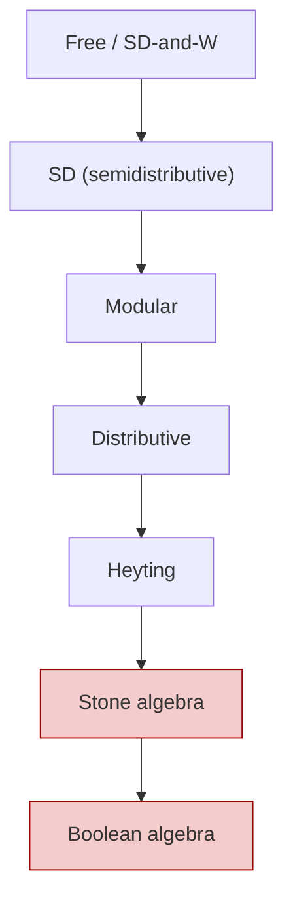
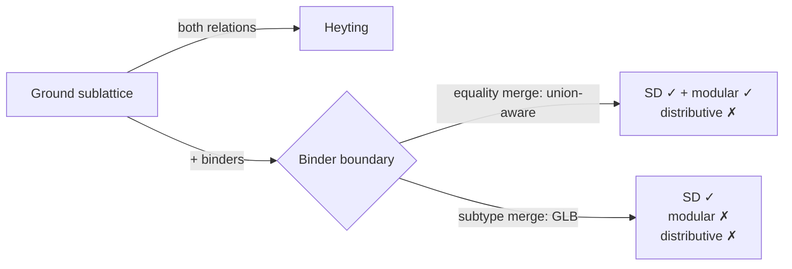

# Prologos Lattice Variety Categorization — Empirical Findings

**Date**: 2026-05-08
**Status**: Stage 0/1 research synthesis. External-facing.
**Audience**: Prof. J. B. Nation (and colleagues with overlapping interests).
**Source data**: 110 algebraic-property-check findings across 4 SRE-registered domains × all relevant relations × {ground, wider} sublattices. Generated by `tools/run-phase9-sweep.rkt` on 2026-05-07. Raw per-domain findings in [`docs/tracking/2026-04-30_SRE_TRACK2I_PHASE9_FINDINGS_RAW/`](../tracking/2026-04-30_SRE_TRACK2I_PHASE9_FINDINGS_RAW/).

---

## Headline

**Whitman's condition (W) holds empirically across every Prologos lattice we measured** — 10/10 (domain × relation × depth) combinations confirm. With strong non-vacuity (the W-antecedent fires in 83-99% of sampled 4-tuples on the type domain), this is not a vacuous confirmation: every Prologos lattice we have built is, on the evidence we can compute, a candidate for free-lattice embedding per the criterion of Theorem 5.55 / 6.9 (Nation 1982). This applies across deeply different domains — types, session protocols, parser-form pipelines, schema-spec wrappers — built independently for compiler purposes without any shared design pressure toward FL-membership.

The system as a whole sits, empirically, in the **SD-or-coarser** part of the variety hierarchy. The interesting variation is *where* in that part: ground sublattices reach Heyting for type-domain relations, but a pervasive break occurs at the **binder boundary** (function/Pi types and their analogues in other domains).

---

## Orientation: Prologos vocabulary ↔ lattice-theoretic terms

A brief mapping in case Prologos-system terms are unfamiliar; lattice-theory readers will recognize all targets.

| Prologos term | Lattice-theoretic mapping |
|---|---|
| **Domain** | A registered family of structurally-decomposable values (e.g., types, sessions, parser forms, schema specs). Each domain has a meet, a join, a bottom, a top, and a constructor registry that says how to decompose compound values. |
| **Relation** | A name distinguishing different orderings on the same underlying value space. The type domain has `equality` (literal equality up to ACI normalization, with union types as joins of incompatible atoms) and `subtype` (partial order with subsumption: `Nat ≤ Int`). Each relation gets its own `(meet, join)` pair. |
| **Meet-registry / merge-registry** | Per-relation lookup: given a relation symbol, return the `(meet, join)` pair specific to that relation. Lets us avoid lattice-mixing (using one relation's meet with another's join). |
| **`ctor-desc`** | Constructor descriptor: for each compound value shape (e.g., `Pi(mult, A, B)` — a dependent function type), records the lattice-spec of each component slot. Drives sample-generation and structural decomposition. |
| **Pi / Sigma types** | Dependent function and pair types. **Pi** ↔ **universal quantifier**: `Pi(x:A, B(x))` is the type of functions taking `x:A` to a value of type `B(x)`. **Sigma** ↔ **existential quantifier**: `Sigma(x:A, B(x))` is the type of pairs `(x:A, b:B(x))`. The third Pi argument is a **multiplicity** in QTT — `m1` = linear (use exactly once), `mw` = unrestricted. |
| **Ground sublattice** | The sublattice generated by atomic types only (`Int`, `Bool`, `Nat`, `String` — no binders, no metavariables, no Pi/Sigma/lam). This is the most-tractable case. |
| **Wider sample / binder-included** | Includes compound types with binders. Surfaces lattice-theoretic phenomena that the ground sublattice doesn't show. |

The empirical sweep iterates samples generated by structural recursion through each domain's `ctor-desc` registry. Sample sizes (after dedup) are: type domain N=6 ground / N=58 wider; session N=3 ground / N=29 wider; form-cell N=7; spec-cell N=5.

---

## Variety placement matrix



**Empirical placements** (✓ = property holds on sampled witness; ✗ = refuted with witness; (W) = Whitman's W):

| Domain | Relation | Depth | SD | Modular | Distributive | Heyting | Stone | Boolean | (W) |
|---|---|---|---|---|---|---|---|---|---|
| type | equality | ground | ✓ | ✓ | ✓ | **✓** | ✗ | ✗ | ✓ |
| type | equality | wider | ✓ | ✓ | ✗ | ✗ | ✗ | ✗ | ✓ |
| type | subtype | ground | ✓ | ✓ | ✓ | **✓** | ✗ | ✗ | ✓ |
| type | subtype | wider | ✓ | ✗ | ✗ | ✗ | ✗ | ✗ | ✓ |
| session | equality | ground | ✗ | ✓ | ✗ | ✗ | ✗ | — | ✓ |
| session | equality | wider | ✗ | ✓ | ✗ | ✗ | ✗ | — | ✓ |
| form-cell | equality | ground | ✓ | ✗ | ✗ | ✗ | ✗ | — | ✓ |
| form-cell | equality | wider | ✓ | ✗ | ✗ | ✗ | ✗ | — | ✓ |
| spec-cell | equality | ground | ✗ | ✗ | ✗ | ✗ | ✗ | ✗ | ✓ |
| spec-cell | equality | wider | ✗ | ✗ | ✗ | ✗ | ✗ | ✗ | ✓ |

Pseudo-complement results (separate column block, since the rel/abs distinction is part of the empirical story):

| Domain | Relation | Depth | has-pc-rel | has-pc-abs | rel-complemented | sect-complemented | breadth ≤ 4 |
|---|---|---|---|---|---|---|---|
| type | equality | ground | ✓ | ✓ | ✗ | ✗ | ✓ |
| type | equality | wider | ✓ | ✓ | ✗ | ✗ | ✗ |
| type | subtype | ground | ✓ | ✓ | ✗ | ✗ | ✓ |
| type | subtype | wider | ✓ | ✓ | ✗ | ✗ | ✗ |
| session | equality | ground | ✗ | ✓ | ✓ | ✗ | ✓ |
| session | equality | wider | ✗ | ✓ | ✓ | ✗ | ✗ |
| form-cell | equality | ground | ✓ | ✓ | ✗ | ✗ | ✗ |
| form-cell | equality | wider | ✓ | ✓ | ✗ | ✗ | ✗ |
| spec-cell | equality | ground | ✗ | ✗ | ✗ | ✗ | ✓ |
| spec-cell | equality | wider | ✗ | ✗ | ✗ | ✗ | ✓ |

Status note on Boolean column (updated 2026-05-08, Phase 11): empirical `has-complement` check now run via `tools/run-phase9-sweep.rkt --properties has-complement`. **Boolean refuted with witness `Int` for all type×{eq,sub} rows** (Int has no `x` such that `Int ∧ x = ⊥` AND `Int ∨ x = ⊤` under either equality or subtype merge — same witness across all 4 type-domain depths). Spec-cell × equality also refutes. Notable: even on the type×{eq,sub}×ground rows where Heyting confirms, Boolean refutes — these lattices are Heyting but NOT Boolean.

This is **architecturally correct for an open-world type system**. The Heyting/non-Boolean placement reflects our design commitment to *Open Extension, Closed Verification* — the type universe is open (new types can always be added), so "what's NOT Int" is an open collection (Bool, String, Nat, all function types, all not-yet-defined types) rather than a single complement type. The Heyting algebra's relative pseudo-complement (`a → b`) is the appropriate backward-flow operator in an open world; classical Boolean complement is foreclosed by construction.

**Bounded vs bounded-below distinction** (Session and form-cell remain "—"):

| Domain | Bounded? | ⊥ | ⊤ | Boolean question well-posed? |
|---|---|---|---|---|
| type | bounded | `type-bot` | `type-top` | yes (refuted, witness Int) |
| spec-cell | bounded | `spec-cell-bot` | `spec-cell-top` (Phase 8d) | yes (refuted) |
| session | bounded-below | `close-session` | — | **no — undefined** |
| form-cell | bounded-below | `form-cell-bot` | — (`#f` placeholder per Phase 8) | **no — undefined** |

Session and form-cell are bounded-below join-semilattices (have ⊥ but no canonical ⊤). The Boolean-algebra complement axiom `a ∨ x = ⊤` is meaningless without ⊤; the question is **architecturally undefined**, not "we didn't measure." If Boolean-algebra-level machinery becomes load-bearing for those domains (none currently planned), the prerequisite work is **defining canonical top semantics for those domains** — a domain-design question (what IS a "maximal session"? a "maximal form-cell"?) — not a sweep-coverage question.

Status note on (W) sample-set scope: empirical claim on sampled 4-tuples, not a constructive proof. Hypothesis non-vacuity ratios per domain × depth are: type 83-95% (ground / wider); session 92-99%; form-cell 64%; spec-cell 87%. Confirmation is non-vacuous; we believe the observation but acknowledge the constructive-proof gap.

---

## Per-domain commentary

### Type domain: dependent types, two relations, sharp binder-boundary asymmetry

The type domain hosts dependent types with QTT multiplicities. Two relations:
- **Equality**: literal equality up to ACI; the join of incompatible atoms is a union type (`Int ⊔ Bool = Int | Bool`); the meet is flat (distinct atoms meet to ⊥ unless one is the bot or top sentinel).
- **Subtype**: partial order with `Nat ≤ Int`; the join is union-with-absorption (`Nat | Int → Int`); the meet is GLB (`meet(Int, Nat) = Nat`).

#### Ground sublattice (atoms only): both relations reach **Heyting**

For samples drawn from `{⊥, ⊤, Int, Bool, Nat, String}` (depth-0):

- **Distributive** confirms (216/216 triples for both relations; non-vacuity 100%)
- **has-pc-rel** confirms (36/36 pairs for both; non-vacuity 100%)
- ⇒ **Heyting** by implication chain `distributive + has-pc-rel ⇒ heyting`

This was a recently-surfaced result for the equality relation. Earlier internal characterization (made before the meet-registry was per-relation) reported the type lattice under equality merge as not distributive. The current per-relation dispatch surfaces the post-redesign reality: both relations hit Heyting on ground.

#### Binder-included sublattice (depth-1, with Pi / Sigma / lam types)

Refutation pattern emerges, with a sharp **equality-vs-subtype asymmetry**:



**Distributivity** refutes for both relations. The minimal witness (depth-1, both relations have it):

```
a = Pi(m1, Bool, Bool),   b = Int,   c = Pi(m1, Int, Bool)

distributive law:  a ∧ (b ∨ c)  =  (a ∧ b) ∨ (a ∧ c)

Under either relation's meet, the LHS and RHS of the law differ on this triple.
```

**SD** confirms for both relations on the wider sample, with a striking asymmetry in non-vacuity:
- `sd-vee`: 6814/195112 antecedents fire (3.5%) — most triples have `a ⊔ b ≠ a ⊔ c` and the SD-vee implication is vacuous
- `sd-wedge`: 178382/195112 (91.4%) — most triples have `a ⊓ b = a ⊓ c` non-vacuously, and the SD-wedge conclusion holds

**Modular**: confirms for `equality`, refutes for `subtype`. The subtype-refutation witness:

```
a = Pi(m1, Bool, Bool),   b = Pi(m1, Int, Bool),   c = Pi(m1, Bool, Bool)
modular law:  a ≤ c  ⇒  a ∨ (b ∧ c) = (a ∨ b) ∧ c
```

Why the asymmetry? Briefly: the equality merge produces *unions* of incompatible atoms, which preserves modularity through the binder boundary because `a ⊔ x` is always a well-defined union type. The subtype merge collapses to GLB on comparable atoms, and the Pi-to-Pi GLB through dependent codomains breaks the modular law's chain of equalities. Stated another way: the subtype meet is structural-recursive into Pi codomains, and the resulting interaction with union-aware joins doesn't sustain modularity once the binder boundary is crossed.

This is the most surprising finding of the sweep. We have hypotheses (substructural-logic non-distributivity at function types; the failure of contraction in linear-logic-flavored type theories), but no settled framing.

### Session domain: protocols, linear-logic flavored, **modular but not SD**

The session domain models communication protocols. Constructors include `close` (terminal session), `send-T` and `recv-T` (carrying a payload type T from the type domain), `select` and `offer` (choice branches), `mu` (recursive sessions). Equality merge produces a join over branches; meet returns shared-prefix structure where it exists.

**Empirical placement: modular ✓, SD ✗** on both depths.

This is unusual in standard lattice theory — modular without SD is not the typical configuration. The classical example is the diamond M3 (modular but not SD); we suspect session × equality has M3-shaped sub-structures arising from session-branching choices.

**Whitman's W** confirms with very high non-vacuity (92.6% ground, 99.9% wider).

**Pseudo-complement decoupling**: `has-pc-rel` refutes; `has-pc-abs` confirms. In a Boolean algebra these coincide; here they decouple. The relative pseudo-complement `a → b` does not exist for some session-pairs even though the absolute `¬a` (= `a → ⊥`) does — interpretable as: there are session pairs where you can express "incompatible-with-a" as a meaningful session, but cannot express "what would a have to be reduced to in order for b to follow."

### Form-cell domain: parser-form pipelines, **SD but not modular**

Form-cells model the staged parser pipeline: each cell holds a record of which transforms (tagged, grouped, done) have applied, plus tree-node references and metadata. The merge is set-intersection over transform sets with metadata-merge logic; the meet is dual.

**Empirical placement: SD ✓, modular ✗** on both depths.

The dual case to session. Reading-Speyer-Thomas FTFSDL canonical form (2019) applies; Birkhoff representation does not. Whitman's W confirms with 64% non-vacuity (modest evidence).

The fact that form-cell × equality is SD without being modular is consistent with Reading-Speyer-Thomas's result that finite SD lattices have a Birkhoff-style representation in terms of cover-relations and a labeling, even without modularity.

### Spec-cell domain: schema-spec wrappers, **bottom of hierarchy**

Spec-cells track schema metadata (name/type-surf bindings, collision flags). The lattice is small (5-element) and structurally simple.

**Empirical placement: only Whitman's W and breadth ≤ 4 confirm**. Every other property refutes: SD ✗, modular ✗, distributive ✗, has-pc-rel ✗, has-pc-abs ✗, rel-complemented ✗, sect-complemented ✗.

Honest characterization: this is essentially a free-lattice-relative structure with a 4-or-fewer-antichain bound (because the lattice is small). It sits at the bottom of the hierarchy.

---

## Open questions for discussion

These are framed as research conversation starters rather than claims.

### Q1. Substructural-logic framing of binder-boundary modularity refutation

We observe that the subtype meet on the type domain refutes modularity at Pi-type triples, while the equality merge preserves it. Two readings we cannot yet adjudicate:

- **Reading A**: This is a substructural-logic phenomenon. Pi types in QTT are linear-logic-flavored (multiplicities = resource accounting), and the failure of contraction at linear function types is what kills modularity at the binder boundary. We'd expect this pattern to recur in any type system with linear or affine dependent functions.
- **Reading B**: This is specific to how our subtype meet happens to be structured (a particular GLB recurrence into codomains). A different but extensionally-equivalent subtype meet might preserve modularity.

Which framing matches lattice-theoretic intuition? Is there standard literature on modular-vs-non-modular distinctions for dependent type lattices specifically?

### Q2. Pseudo-complement decoupling on session × equality

`has-pc-abs` confirms but `has-pc-rel` refutes for session × equality. In any Boolean algebra these coincide; in distributive Heyting algebras the relative form generalizes the absolute (b=⊥). The decoupling here happens on a *non-distributive* lattice.

Is this decoupling a known phenomenon in modular-not-SD lattices? Is it characteristic of M3-shaped sub-structures, or of session-branching specifically?

### Q3. SD-vee versus SD-wedge non-vacuity asymmetry

On type × wider, sd-vee fires non-vacuously in 3.5% of triples; sd-wedge in 91.4%. The 26-fold asymmetry suggests the lattice's join is "spreadier" than its meet on these samples — most pairs `(a, b)` and `(a, c)` join to *different* unions but meet to a *common* atom or sub-element.

Is this asymmetry typical of distributive-on-ground / SD-on-wider lattices? Does it have a known characterization in terms of join-irreducible vs meet-irreducible counts?

### Q4. Whitman's W ✓ across heterogeneous domains

Every domain confirms (W). Domains were designed independently for compiler purposes (type system, session protocols, parser pipelines, schema specs) — no design pressure toward FL-membership was applied. Yet the empirical result is uniform.

Is there a structural reason to expect (W) to hold for the kind of constructor-recursive lattices that arise from algebraic data type definitions? Is FL-membership the "default" placement for algebraic-data-type lattices, with violations only emerging under specific design choices?

### Q5. Stone identity universally refutes

`¬a ∨ ¬¬a = ⊤` fails on every domain we measured. Stone algebras are the algebraic counterpart of Gödel-Dummett intermediate logic; their absence in our system suggests that intermediate-logic-flavored type-checking machinery (e.g., decidable double-negation translations) doesn't have a structural foothold here.

Does the universal refutation of Stone identity carry implications for the kinds of meta-logic our system can or cannot host?

### Q6. Breadth bound exceeded at wider samples

The Jónsson-Kiefer-Nation 1962 bound (breadth ≤ 4 for finite sublattices of FL on a generating set of any cardinality) exceeds at wider samples for type, session, and form-cell. On type × subtype × wider, we found 5-element antichains.

We interpret this as: **our wider sample is not a finite sublattice of FL** in the strict sense — it includes free-generated structure beyond the bound. Or: the bound is a feature of FL on a fixed finite generator set, and our depth-1 generation procedure produces a richer structure than such a generator. Which framing is right?

---

## What we did not measure (and what we are about to)

In the spirit of honest scope, the following were *not* measured for the variety-placement matrix above. **Phases 11-15 (in progress as of 2026-05-08) address each**; this section will be updated in-place once those land:

- ~~**`has-complement`** (Boolean-algebra membership). Phase 11. Per-element search for complements; closes the Boolean column of the variety-placement matrix (currently uniformly "—").~~ **DONE 2026-05-08**: Boolean refuted with witness `Int` for type×{eq,sub} (all depths) and spec-cell × equality (all depths). Session and form-cell remain untested due to sample-set bot/top absence; sister-concern requires per-domain atom-pool enrichment.
- **M3 / N5 sublattice detection** (Birkhoff's forbidden-sublattice theorem). Phase 12. Empirical sublattice check provides concrete witness for *why* distributivity refutes — the specific 5-element subset that is order-isomorphic to the diamond M3 or pentagon N5.
- **Convex-geometry / anti-exchange characterization** (Adaricheva-Gorbunov-Tumanov 2003). Phase 13. For SD-confirmed domains, dualize via the canonical closure operator on join-irreducibles. The AGT 2003 theorem ties finite join-semidistributive lattices to convex geometries iff anti-exchange holds — empirical confirmation would substantively connect our system to convex-geometry literature.
- **Targeted congruences** — specific candidate congruences (kernel of multiplicity-forgetful map; canonical-form projection). Phase 14. Restricted scope: cannot fully characterize `Con(L)` (O(2^N) explosive) but can confirm/refute specific candidates relevant to our system's structure.
- **Day's doubling / inflation** detection (Adaricheva-Nation 2017). Phase 15. Test for interval-doubling structure in lattice samples; speculative test framing.

Beyond the immediate Phase 11-15 set, broader open frontiers we have not approached:

- **Variety membership beyond (W) + SD** — classification into specific subvarieties of SD (e.g., the Tamari lattice variety, or the variety of lattices of normal subgroups). Out of scope for Phase 11-15.
- **Non-trivial automorphism groups** — `Aut(L)` for any of our domains.
- **Continuity / algebraicity** of the lattice in the order-topological sense (Scott domains, etc.).

---

## Methodology note

Each property is checked by enumerating the relevant tuple shape over the sample set and verifying the axiom:
- **Distributivity, modularity, SD-vee, SD-wedge, Stone identity**: triples (a, b, c)
- **Pseudo-complement (rel)**: pairs (a, b); for each, find the candidate `a → b = ⋁{x : x ∧ a ≤ b}`, verify it satisfies the axiom
- **Pseudo-complement (abs)**: singletons; for each `a`, find candidate `¬a = ⋁{x : x ∧ a = ⊥}`, verify
- **Whitman's W**: 4-tuples (a, b, c, d); for each with antecedent `a ∧ b ≤ c ∨ d`, verify one of the four disjunctive consequents
- **Relatively / sectionally complemented**: intervals + element-search
- **Breadth bound**: enumerate (k+1)-element subsets, check all-pairwise-incomparable

Refutations carry an explicit witness; confirmations carry a count of the axiom's hypothesis-fired (non-vacuous) triples plus a conclusion-held count. Sample sets are bounded; refutation is a strong claim, confirmation is a sample-set-relative claim with non-vacuity transparency.

---

## References

- Freese, R., Ježek, J., Nation, J. B. (1995). *Free Lattices*. AMS Mathematical Surveys and Monographs **42**.
- Nation, J. B. (1982). Finite sublattices of a free lattice. *Trans. Amer. Math. Soc.* **269**, 311-337. (Theorem 5.55 / 6.9.)
- Jónsson, B., Kiefer, J. E. (1962). Finite sublattices of a free lattice. *Canadian J. Math.* **14**, 487-497. (Breadth-4 theorem.)
- Reading, N., Speyer, D., Thomas, H. (2019/2021). The fundamental theorem of finite semidistributive lattices. *Selecta Math. (N.S.)* **27**(59).
- Adaricheva, K., Gorbunov, V. A., Tumanov, V. I. (2003). Join-semidistributive lattices and convex geometries. *Adv. Math.* **173**, 1-49.
- Adaricheva, K., Nation, J. B. (2017). Inflation of finite lattices along all-or-nothing sets.
- Birkhoff, G. (1933). On the combination of subalgebras. *Proc. Cambridge Phil. Soc.* **29**, 441-464.

## Appendix

Per-domain raw findings (full witnesses, non-vacuity counts) at:
- [`type-eq.md`](../tracking/2026-04-30_SRE_TRACK2I_PHASE9_FINDINGS_RAW/type-eq.md)
- [`type-sub.md`](../tracking/2026-04-30_SRE_TRACK2I_PHASE9_FINDINGS_RAW/type-sub.md)
- [`session.md`](../tracking/2026-04-30_SRE_TRACK2I_PHASE9_FINDINGS_RAW/session.md)
- [`form-cell.md`](../tracking/2026-04-30_SRE_TRACK2I_PHASE9_FINDINGS_RAW/form-cell.md)
- [`spec-cell.md`](../tracking/2026-04-30_SRE_TRACK2I_PHASE9_FINDINGS_RAW/spec-cell.md)
