# Prologos Series Dependency Diagram

Date: 2026-04-29

A condensed, opinionated read of `MASTER_ROADMAP.org` that names every active
"piece" (Series or notable Track) and the arrows that say *enables*. For the
authoritative status, dates, PIRs, and design docs, see
[`MASTER_ROADMAP.org`](MASTER_ROADMAP.org).

Status legend in the diagram: ✅ complete · 🔄 in flight · ⬜ planned ·
↳ supersedes · `-.->` "feeds / informs" (theory feedback) ·
`==>` "is the convergence point for" (load-bearing).

## The pieces

### Substrate

- **PM (Propagator Migration)** — bring elaboration state on-network. Foundation
  for everything; Tracks 1–8D, 8F, 10, 10B done. 8E, 10C, 11 (LSP), 12+ open.
- **PUnify** — cell-tree structural unification. Broken out from the original
  Track 8; now a prerequisite for SRE and BSP-LE Track 2.
- **PAR (Parallel Scheduling)** — stratified topology + BSP. Track 0/1 ✅,
  Track 2 R1–R2 ✅; supersedes BSP-LE Track 4. Cross-cuts every series that
  uses propagators.

### Solvers / engines

- **BSP-LE (Logic Engine on Propagators)** — choice = ATMS, conjunction =
  worklist, backtracking = nogood, tabling = quiescence, parallel = BSP. Track 0
  ✅; 1 / 1.5 / 2 / 3 / 5 pending; Track 4 → PAR.
- **UCS (Universal Constraint Solving)** — research-stage `#=` operator over a
  domain-polymorphic quantale, on top of SRE 2F.

### Reasoning

- **SRE (Structural Reasoning Engine)** — PUnify generalized to all structural
  decomposition. Tracks 0, 1, 1B, 2, 2D, 2G, 2H ✅. 2F (algebraic foundation),
  3 (trait resolution), 4 (sessions / patterns), 5 (= PM 9 reduction), 6 (= PM
  10 module loading) pending.

### Application series

- **PPN (Propagator Parsing Network)** — parsing as attribute evaluation as
  propagator fixpoint. Tracks 0, 1, 2, 2B, 4A, 4B ✅; 4C in flight; 3, 3.5
  (Grammar Form), 4D, 5–9 pending. Highest-leverage active stack.
- **CIU (Collection Interface Unification)** — collections as trait dispatch on
  the network. Track 0 ✅; 1–2 pre–PM 8; 3–5 post–PM 8, gated on SRE 3.
- **PReductions (= PM Track 9)** — β/δ/ι reduction, e-graphs, interaction nets,
  tropical extraction.
- **FFI** — polyglot hub. Tracks 0/1 ✅, 2 (off-network scaffolding) pending
  merge, 3 (propagator-native callbacks) retires the scaffolding.

### Cross-cutting / theory

- **NTT (Network Type Theory)** — types for cells, propagators, networks,
  bridges, stratification, fixpoints. Stage 0–1 research. Crystallizes from PM
  + PPN + SRE + PReductions discoveries.
- **PRN (Propagator-Rewriting-Network)** — hyperlattice-rewriting formalism.
  Stage 0 theory; emerges from PPN/SRE/PReductions/BSP-LE finding the same
  primitives.
- **PTF (Propagator Theory Foundations)** — kind taxonomy (Map / Reduce /
  Broadcast / Scatter / Gather). Track 0 ✅; feeds NTT and PAR.
- **OE (Optimization Enrichment)** — tropical semiring enrichment over every
  network. Cross-cutting; produces lattices that PPN / PReductions / BSP-LE
  consume.

### Capstone

- **SH (Self-Hosting)** — placeholder series. Compiler IS the network; blocked
  on PPN Track 4+ + LLVM lowering + GC research.

## Convergence points

Three nodes carry most of the cross-series load:

1. **PM Track 8** ✅ unblocked CIU 3–5, BSP-LE 1–5, and SRE 0–1.
2. **SRE 2H** (type lattice as a quantale) ✅ unblocked PPN Track 4 (typing on
   network).
3. **PPN Track 4C** 🔄 elaboration completely on-network — pulls in BSP-LE 1.5
   (cell-based TMS) and BSP-LE 2 (ATMS solver) as sub-tracks; the gateway to PPN
   4D and ultimately SH.

## Diagram

```mermaid
flowchart TD
  classDef done fill:#cfe8d4,stroke:#2c7a3f,color:#0a3a18;
  classDef active fill:#fde9b3,stroke:#a06a00,color:#3a2700;
  classDef planned fill:#e6e6e6,stroke:#7a7a7a,color:#222;
  classDef theory fill:#dde6ff,stroke:#3856a8,color:#10204a;

  %% ====== Substrate ======
  subgraph PM["PM — Propagator Migration"]
    PM1["Tracks 1–7 ✅<br/>cells, registries,<br/>ATMS, persistent retraction"]:::done
    PM8["Track 8 / 8D ✅<br/>HKT + bridge propagators<br/>pure α/γ"]:::done
    PM8E["8E ⬜<br/>17 registries as cells"]:::planned
    PM8F["8F ✅<br/>meta-info as cells"]:::done
    PM10["10 ✅<br/>module loading + .pnet"]:::done
    PM10B["10B ✅<br/>session metas as cells"]:::done
    PM10C["10C ⬜<br/>per-test Places"]:::planned
    PM11["11 ⬜<br/>LSP integration"]:::planned
    PM12["12+ ⬜<br/>module-load cells"]:::planned
  end

  PUnify["PUnify Parts 1–2 ✅<br/>cell-tree unification"]:::done

  subgraph PAR["PAR — Parallel Scheduling"]
    PAR0["Track 0 ✅<br/>CALM topology audit"]:::done
    PAR1["Track 1 ✅<br/>BSP-as-default"]:::done
    PAR2["Track 2 R1–R2 ✅<br/>true parallel POC"]:::done
    PAR2R["Track 2 R3–R5 ⬜"]:::planned
    PAR3["Track 3 ⬜<br/>:auto heuristic"]:::planned
  end

  %% ====== Solvers ======
  subgraph BSPLE["BSP-LE — Logic Engine"]
    BSP0["Track 0 ✅<br/>allocation efficiency"]:::done
    BSP1["1 ⬜ UnionFind"]:::planned
    BSP15["1.5 ⬜ cell-based TMS"]:::planned
    BSP2["2 ⬜ ATMS solver"]:::planned
    BSP3["3 ⬜ SLG tabling"]:::planned
    BSP5["5 ⬜ solver language"]:::planned
  end

  subgraph UCS["UCS"]
    UCSR["R0–R2 ⬜ research"]:::planned
    UCSI["1–4 ⬜ #= / CDCL / quantale"]:::planned
  end

  %% ====== Reasoning ======
  subgraph SRE["SRE — Structural Reasoning"]
    SRE0["Track 0 ✅<br/>form registry"]:::done
    SRE1["Tracks 1 / 1B ✅<br/>relation engine"]:::done
    SRE2["Track 2 ✅<br/>elaborator-on-SRE"]:::done
    SRE2D["2D ✅ DPO rules"]:::done
    SRE2F["2F ⬜<br/>algebraic foundation"]:::planned
    SRE2G["2G ✅<br/>algebraic domain awareness"]:::done
    SRE2H["2H ✅<br/>type lattice = quantale"]:::done
    SRE3["3 ⬜ trait resolution"]:::planned
    SRE4S["4 ⬜ sessions"]:::planned
    SRE4P["4 ⬜ patterns"]:::planned
    SRE5["5 ⬜ reduction (= PM 9)"]:::planned
    SRE6["6 ⬜ module loading (= PM 10)"]:::planned
  end

  %% ====== Application ======
  subgraph PPN["PPN — Parsing on the Network"]
    PPN0["Track 0 ✅ lattices"]:::done
    PPN1["Track 1 ✅ lexer"]:::done
    PPN2["Track 2 / 2B ✅<br/>surface normalization"]:::done
    PPN3["3 ⬜<br/>parser as propagators"]:::planned
    PPN35["3.5 ⬜ Grammar Form"]:::planned
    PPN4A["4A ✅ typing on-network"]:::done
    PPN4B["4B ✅ full attribute eval"]:::done
    PPN4C["4C 🔄<br/>elaboration on-network"]:::active
    PPN4D["4D ⬜<br/>attribute grammar substrate"]:::planned
    PPN5["5 ⬜ disambiguation"]:::planned
    PPN6["6 ⬜ error recovery"]:::planned
    PPN7["7 ⬜ user grammar extensions"]:::planned
    PPN8["8 ⬜ incremental edit (= PM 11)"]:::planned
    PPN9["9 ⬜ self-describing serialization"]:::planned
  end

  subgraph CIU["CIU — Collections"]
    CIU0["Track 0 ✅ trait hierarchy"]:::done
    CIU12["1–2 ⬜ Seq + sugar"]:::planned
    CIU35["3–5 ⬜ trait dispatch"]:::planned
  end

  subgraph PReds["PReductions (= PM Track 9)"]
    PR0["0 ⬜ e-graphs"]:::planned
    PR1["1 ⬜ β/δ/ι DPO"]:::planned
    PR2["2 ⬜ interaction nets"]:::planned
    PR3["3 ⬜ tropical extraction"]:::planned
    PR4["4 ⬜ elaborator integration"]:::planned
  end

  subgraph FFI["FFI"]
    FFI01["0 / 1 ✅ marshaling"]:::done
    FFI2["2 🔄 lambda passing<br/>(scaffolding)"]:::active
    FFI3["3 ⬜ propagator-native callbacks"]:::planned
  end

  %% ====== Theory ======
  subgraph Theory["Theory layer"]
    NTT["NTT 🔄<br/>typed propagator networks"]:::theory
    PRN["PRN ⬜<br/>hyperlattice rewriting"]:::theory
    PTF0["PTF 0 ✅ kind taxonomy"]:::done
    PTF15["PTF 1–5 ⬜"]:::planned
    OE0["OE 0 ⬜ tropical lattice"]:::planned
    OE14["OE 1–4 ⬜<br/>weighted parsing / rewriting / search / CSP"]:::planned
  end

  SH["SH — Self-Hosting ⬜"]:::planned

  %% ====== PM internal ======
  PM1 --> PM8 --> PM8E
  PM8 --> PM8F --> PM10 --> PM10B --> PM10C
  PM10 --> PM11
  PM10B --> PM12

  %% ====== PM enables everything ======
  PM8 ==> PUnify
  PM8 ==> SRE0
  PM8 ==> CIU35
  PM8 ==> BSP1
  PM8F --> SRE5
  PM8F --> PR1
  PM10 -. equals .- SRE6
  PM12 -. informs .- SRE6

  %% ====== PUnify ======
  PUnify --> SRE0
  PUnify --> BSP2

  %% ====== PAR chain ======
  PAR0 --> PAR1 --> PAR2 --> PAR2R --> PAR3
  PAR1 -. cross-cut .-> BSPLE
  PAR1 -. cross-cut .-> SRE
  PAR1 -. cross-cut .-> PPN

  %% ====== BSP-LE chain ======
  BSP0 --> BSP1 --> BSP2
  BSP0 --> BSP15 --> BSP2
  BSP2 --> BSP3 --> BSP5
  BSP15 ==> PPN4C
  BSP2 ==> PPN4C

  %% ====== SRE chain ======
  SRE0 --> SRE1 --> SRE2
  SRE1 --> SRE2D
  SRE1 --> SRE2F
  SRE1 --> SRE2G --> SRE2H
  SRE1 --> SRE3
  SRE2F -. foundation .-> SRE3
  SRE0 --> SRE4P
  SRE1 --> SRE4S
  SRE1 --> SRE5
  SRE2H ==> PPN4A

  %% ====== PPN chain ======
  PPN0 --> PPN1 --> PPN2 --> PPN3
  PPN3 --> PPN35
  PPN3 --> PPN4A --> PPN4B --> PPN4C --> PPN4D
  PPN4C --> PPN5 --> PPN7
  PPN5 --> PPN8
  PPN3 --> PPN6
  PPN3 --> PPN9
  PPN8 --> PM11

  %% ====== CIU ======
  CIU0 --> CIU12
  CIU0 --> CIU35
  SRE3 ==> CIU35

  %% ====== PReductions ======
  SRE0 --> PR0 --> PR1 --> PR2
  PR1 --> PR3
  PR1 --> PR4
  SRE2 --> PR4
  PR1 -. equals PM9 .- SRE5

  %% ====== FFI ======
  FFI01 --> FFI2 --> FFI3

  %% ====== Theory feedback ======
  PM1 -. crystallizes .-> NTT
  PPN3 -. feeds .-> NTT
  SRE0 -. feeds .-> NTT
  PR1 -. feeds .-> PRN
  PPN3 -. feeds .-> PRN
  SRE0 -. feeds .-> PRN
  BSP2 -. feeds .-> PRN
  PTF0 --> PTF15
  PTF15 -. informs .-> PAR3
  NTT -. types .-> PPN7

  %% ====== OE cross-cuts ======
  OE0 --> OE14
  OE14 -. weights .-> PPN3
  OE14 -. weights .-> PR3
  OE14 -. weights .-> BSP2

  %% ====== UCS ======
  UCSR --> UCSI
  SRE2F --> UCSI

  %% ====== Capstone ======
  PPN4C --> SH
  PPN7 --> SH
  PR4 --> SH
  SRE6 --> SH
```

## Reading the arrows

- A solid `-->` is a hard prerequisite or design dependency someone has named in
  the roadmap.
- A `==>` is a load-bearing convergence (one piece *materially* unblocks
  another, e.g. PM 8 → CIU 3–5).
- A dotted `-.->` is a feedback or cross-cut: the source isn't a literal
  prerequisite, but its output shapes the target (theory series, OE
  enrichment, PAR scheduling).
- "= PM N" / "= SRE N" labels mark identified equivalences across series.
